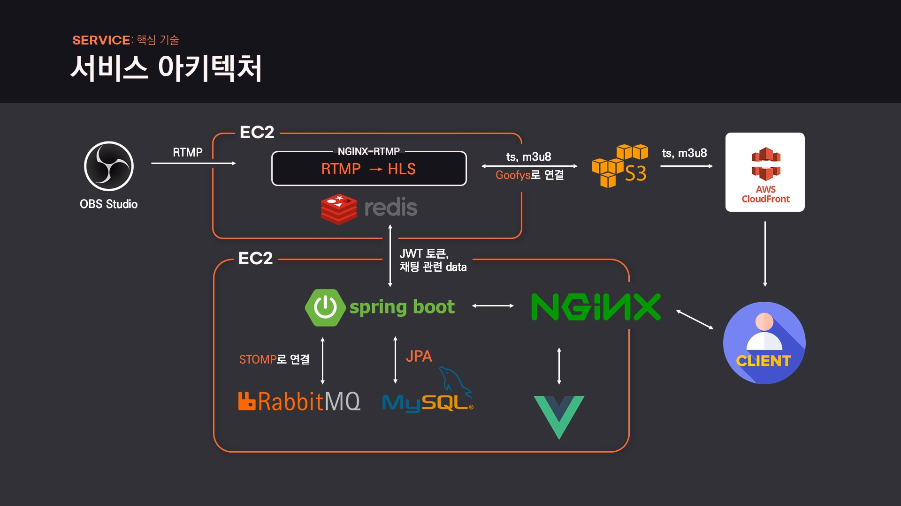

# LearnUs ⛰

> 온라인 교육을 위한 라이브 스트리밍 플랫폼 개발 공간입니다.

## 🌟 Overview

- **LearnUs**는, 라이브 스트리밍을 활용한 온라인 교육 플랫폼입니다.
  1년간 삼성 청년 SW 아카데미(이하 SSAFY)를 이수하며 느낀 점을 기반으로, **온라인 교육만을 위한 라이브 스트리밍 플랫폼**을 만들어 교육생과 운영진에 더 편리한 교육 경험을 제공하고자 했습니다.
  이에 MatterMost, EDU SSAFY, Youtube 등 **여러 플랫폼에 분산되어 있는 기능을 하나로** 모았습니다. 원활한 수업 진행을 위해 안정적으로 라이브 스트리밍이 진행되면서 지연시간을 최소화하고, 웹 소켓 통신을 통해 실시간 채팅 뿐 아니라 출석체크, 퀴즈 기능을 제공합니다. 

## 🚀 Service

## 🌈 About

- 주요 기술 스택 및 라이브러리

  | Frontend                                                     | Backend                                                  | Infra                                                        |
  | ------------------------------------------------------------ | -------------------------------------------------------- | ------------------------------------------------------------ |
  | Vue.js, Vuex HTML, SCSS, JavaScript Axios, Viedojs, Stompjs AWS-SDK | Spring boot, JPA MySQL Stomp, RabitMQ JWT | AWS EC2 Nginx, Nginx-RTMP  Jenkins  AWS S3, Goofys,  Cloud Front CDN  AWS RDS |

- 서비스 아키텍처

  

- 팀원 정보 및 업무 분담

  

